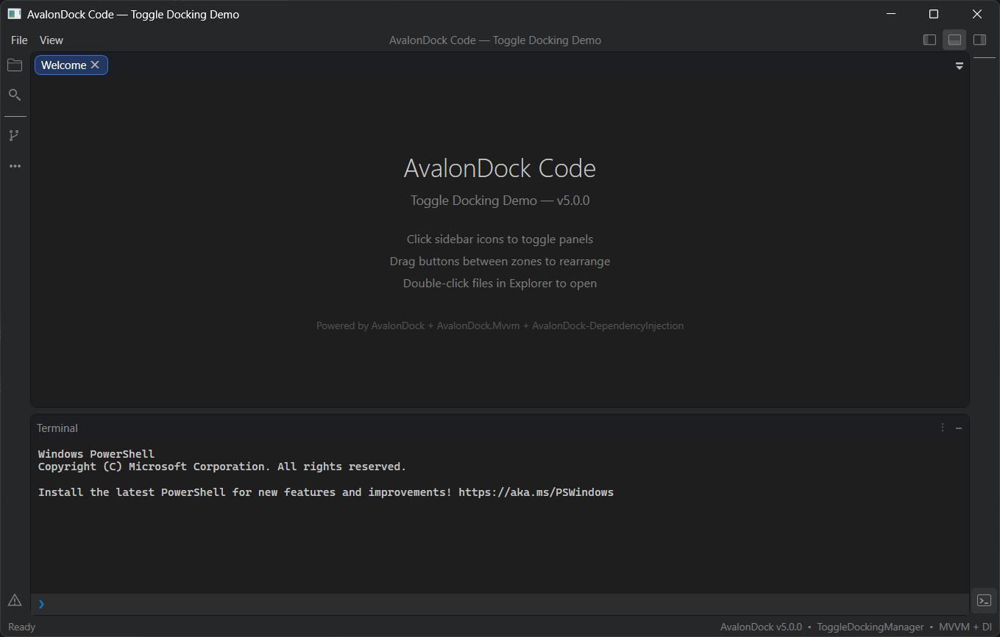
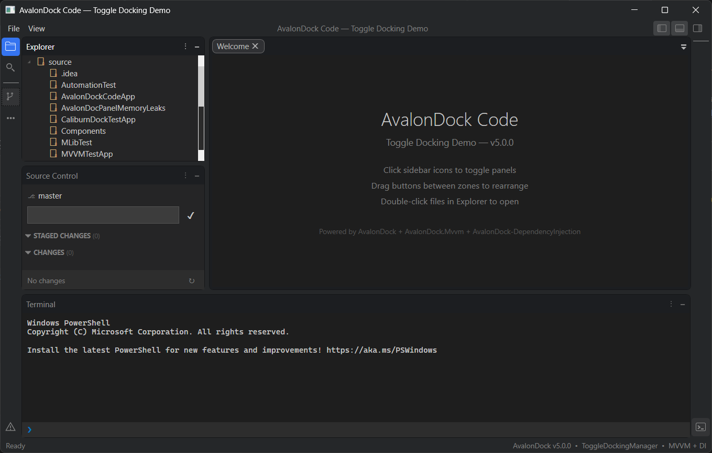
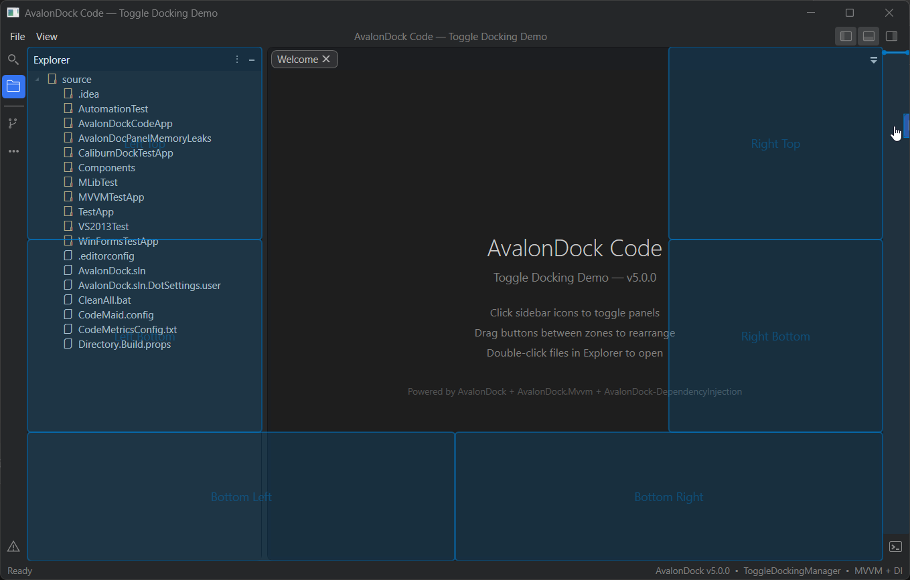
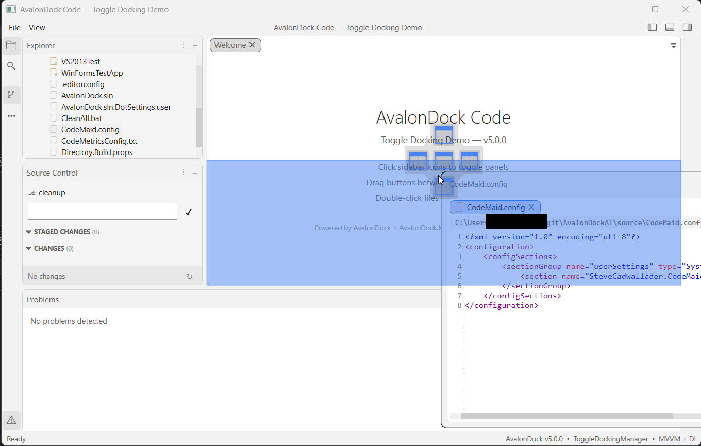

After years of contributing to [AvalonDock](https://github.com/Dirkster99/AvalonDock) through incremental fixes, maintenance work, and community support, I'm deep into what I expect to be **the most meaningful release I've been part of in my open-source career**.

v5 is currently in **early pre-alpha** — not yet released, still actively under development. This post is a reflection on where AvalonDock came from, what v5 is changing under the hood, and why it matters.

## Table of contents

## A Brief History of AvalonDock

To appreciate AvalonDock v5, it helps to understand just how long this library has been around.

### The CodePlex Era — AvalonDock 1.x & 2.x

AvalonDock was born on **CodePlex**, Microsoft's open-source project hosting platform, sometime around 2007–2008. It was one of the early WPF docking libraries — a community answer to the question: "how do I build a Visual Studio-style layout in WPF?" At a time when WPF itself was still brand new, this was non-trivial.

The v1 and v2 era was genuinely community-driven. Releases lived on CodePlex, the community filed bugs, contributed patches, and kept things alive. SharpDevelop, the open-source C#/VB.NET IDE, famously adopted AvalonDock when it migrated to WPF — which was probably the library's biggest early endorsement.

### Xceed Takes Over — v3.x

Eventually, **Xceed Software** folded AvalonDock into their [Extended WPF Toolkit](https://github.com/xceedsoftware/wpftoolkit) and took stewardship of the v3.x line. This had a profound impact on the project's trajectory: Xceed maintained the codebase under an open-source license (up through v3.x) but shifted their commercial focus elsewhere. Community PRs piled up, issues went stale, and the pace of development slowed noticeably.

The `DockingManager` — the library's central class — was already carrying years of accumulated complexity, and the Xceed era largely added to it without cleaning it up.

### The Dirkster99 Fork — v4.x

This is where things got interesting again. **[Dirkster99](https://github.com/Dirkster99)** forked AvalonDock from the last permissively licensed Xceed version (v3.2–3.6) and started maintaining it independently. The key decision was to **keep it free for commercial and open-source use** — something that was no longer guaranteed with the Xceed version. Version 4.0 even reverted to the original `AvalonDock` namespace (the pre-Xceed `Xceed.Wpf.AvalonDock` prefix was dropped), signaling a clean break.

The v4 era brought real improvements: .NET (Core) support, HiDPI fixes, better theme coverage, and a much more active issue tracker. But architecturally, it was still the same codebase that had accumulated complexity since the CodePlex days. Tests were hard to write. The layout engine was deeply entangled with WPF. Serialization was bolted on via a single `XmlLayoutSerializer`. The seams that should have existed between model and view simply didn't.

That is the codebase I started working with — and the one v5 begins to fix.

---

## What AvalonDock v5 Is Changing

### Dropping End-of-Life .NET Versions

The first concrete step was cutting support for all EOL .NET runtimes. This means AvalonDock v5 targets **only actively supported .NET versions** — currently .NET Framework 4.8, .NET 9, and .NET 10.

This might sound like housekeeping, but it has real downstream effects. It removes years of `#if` conditional compilation blocks. It enables use of modern C# language features and runtime APIs. It simplifies the CI matrix. And it sends a message: this library is for modern .NET, full stop.

The target framework moniker in the project file now looks like this instead of a list of eight TFMs:

```xml
<TargetFrameworks>net48-windows;net9.0-windows;net10.0-windows</TargetFrameworks>
```

### Introducing AvalonDock.Core

This is the architectural change I'm most proud of, and the one with the most long-term impact.

**AvalonDock.Core** is a new project in the solution that extracts the docking and layout engine from the WPF layer and expresses it as **plain .NET code** — no `System.Windows`, no XAML, no `DependencyObject`. It's a UI-agnostic class library.

The layout model — `LayoutRoot`, `LayoutPanel`, `LayoutDocument`, `LayoutAnchorable`, and the rest of the `ILayout*` interfaces — now lives here, independently of WPF rendering.

**Why does this matter concretely?**

Before this change, writing a unit test for layout logic meant spinning up a WPF `Application`, touching `Dispatcher`, dealing with WPF threading rules, and hoping your test runner supports STA threads. A test that should take 5ms took 500ms to set up, and many things simply couldn't be tested at all.

After this change, a test for layout serialization looks like this:

```csharp
// No WPF dependencies required
[Test]
public void LayoutRoot_ShouldSerializeAndDeserializeDocuments()
{
    var root = new LayoutRoot();
    var pane = new LayoutDocumentPane();
    var doc = new LayoutDocument { Title = "MyDocument" };
    pane.Children.Add(doc);
    root.RootPanel = new LayoutPanel { Children = { pane } };

    var serializer = new XmlLayoutSerializer();
    var xml = serializer.Serialize(root);

    var restored = serializer.Deserialize(xml);

    Assert.Single(restored.RootPanel.Children
        .OfType<LayoutDocumentPane>()
        .First().Children);
}
```

No WPF. No `Application.Current`. No thread affinity issues. Just logic.

This separation also means the door is now open — at least architecturally — for other UI frameworks to sit on top of the same engine. That's not a v5 deliverable, but it's no longer structurally impossible. [PR #566](https://github.com/Dirkster99/AvalonDock/pull/566) already provides additional separation between the core and WPF layers, making it easier to swap out the WPF rendering for the UNO platform. 

---

## What's Shipped and What's Next

Since this is early pre-alpha, most of the high-level features are already implemented but still experimental. Here's what's planned and what they'll look like when they land.

### First-Class Dependency Injection Support

Today, getting AvalonDock to play nicely with a DI container requires workarounds. v5 ships a set of `IServiceCollection` extension methods that make DI a first-class citizen.

With v5, a single `AddDockLayoutService` call with a `DockLayoutBuilder` wires up toggle dock options and toolbox ViewModels in one self-documenting composition root:

```csharp
private static void ConfigureServices(IServiceCollection services)
{
    services.AddDockLayoutService(dock =>
    {
        dock.ConfigureToggleDock(opts =>
        {
            opts.ButtonSize = 28;
            opts.DefaultDockWidth = 280;
            opts.DefaultDockHeight = 220;
            opts.LayoutPriority = nameof(DockLayoutPriority.BottomFullWidth);
        });

        // Register toolboxes — order determines sidebar button order
        dock.AddToolbox<FolderExplorerViewModel>(sp => new FolderExplorerViewModel(_ => { }));
        dock.AddToolbox<SearchViewModel>();
        dock.AddToolbox<SourceControlViewModel>();
        dock.AddToolbox<ProblemsViewModel>();
        dock.AddToolbox<TerminalViewModel>();
    });

    services.AddSingleton<MainViewModel>();
    services.AddSingleton<MainWindow>();
}
```

The builder pattern groups all related registrations under a single entry point. `AddToolbox<T>` registers each tool panel ViewModel as a singleton; the `DockLayoutBuilder` then collects all registered `IToolbox` instances and builds the layout tree automatically. Your ViewModels get full constructor injection — no `Activator.CreateInstance`, no static service locators.

Additional extension methods cover the rest of the surface area: `AddAvalonDock<TFactory>` for a custom content factory, `AddAvalonDockSerializer<T>` for a pluggable serializer, `AddAvalonDockThemeManager<T>`, `AddDockingManager`, `AddAutoHideManager<T>`, `AddFloatingWindowService<T>`, and `AddDragDropHandler<T>`.

### First-Class MVVM Support

The DI integration above also drives the MVVM story. `IDockLayoutService` auto-builds the dock layout tree from all registered `IToolbox` instances, and your ViewModel exposes it as a single bindable property:

```csharp
public class MainViewModel
{
    private readonly IDockLayoutService _dockService;

    public MainViewModel(IDockLayoutService dockService, SideToggleManager sideToggle)
    {
        _dockService = dockService;
        // ...
    }

    /// <summary>Bind to DockLayout on the DockingManager.</summary>
    public IRootDock DockLayout => _dockService.Layout;
}
```

In XAML you bind `DockLayout` directly to the manager — no manual wiring of `DocumentsSource`, `AnchorablesSource`, or `LayoutItemContainerStyle`. The layout model stays in sync automatically because it was built from your ViewModels in the first place.

### Toggle Docking Manager

One of the features I'm personally most excited about is a new optional docking mode inspired by VSCode and IntelliJ: **panel toggling** instead of permanent docking.

In classic AvalonDock, tool windows are either docked in the layout or floating. In the Toggle mode, panels appear and disappear on demand — think "Properties" pane that slides in when you need it and collapses completely when you don't, without permanently occupying layout space.
This is implemented as a new `ToggleDockingManager` control that sits alongside the existing `DockingManager`. It has its own layout engine and serialization, but shares the same core docking logic. You can use it for specific panels while keeping others in the traditional docked style.

### Serialization — DTO-Based and Format-Agnostic

One of the biggest legacy topics was also tackled: the entire serialization stack has been [rebuilt around a DTO layer](https://github.com/Dirkster99/AvalonDock/pull/580), completely removing `IXmlSerializable` from the layout model classes. Previously, every layout element (`LayoutRoot`, `LayoutPanel`, `LayoutAnchorable`, etc.) was responsible for its own XML serialization through `ReadXml`/`WriteXml` overrides — tightly coupling the model to a single format with an unresolvable dependency on WPFs Dispatcher for any serialization logic.

Now, a dedicated `LayoutDtoMapper` translates between the live layout tree and a clean set of DTO classes (`LayoutRootDto`, `LayoutPanelDto`, `LayoutDocumentDto`, etc.). Serializers operate on DTOs, not on the model directly. This means:

- **The layout model classes lost ~900 lines of serialization boilerplate.** They're cleaner and easier to reason about.
- **Any serializer can be plugged in** by inheriting `LayoutSerializerBase` against the DTO layer — XML, JSON, or your own format without touching the core layout model or WPF-specific logic.

```csharp
public abstract class LayoutSerializerBase : ILayoutSerializer
{

    ......

    public void Serialize(Stream stream)
    {
        var dto = Manager.DtoMapper.ToDto(Manager.Layout);
        SerializeCore(stream, dto);
    }

    public void Deserialize(Stream stream)
    {
        ....
        var dto = DeserializeCore(stream);
        var layout = Manager.DtoMapper.FromDto(dto);
        ....       
    }

    /// <summary>Writes the layout DTO to the stream in the concrete format (XML, JSON, etc.).</summary>
    /// <param name="stream">The stream to write to.</param>
    /// <param name="dto">The layout root DTO to serialize.</param>
    protected abstract void SerializeCore(Stream stream, LayoutRootDto dto);

    /// <summary>Reads a layout DTO from the stream in the concrete format.</summary>
    /// <param name="stream">The stream to read from.</param>
    /// <returns>The deserialized layout root DTO.</returns>
    protected abstract LayoutRootDto DeserializeCore(Stream stream);

    .....
}
```

The `XmlLayoutSerializer` and `JsonLayoutSerializer` ship as separate NuGet packages (`Dirkster.AvalonDock.Serializer.Xml` and `Dirkster.AvalonDock.Serializer.Json`), and you can bring your own:

```csharp
// Use the new JSON serializer
var serializer = new JsonLayoutSerializer(dockingManager);
serializer.Serialize("layout.json");

// Restore on next launch
serializer.Deserialize("layout.json");
```

### VS2022 Theme

A new [VS2022 theme](https://github.com/Dirkster99/AvalonDock/pull/582) has been added with Blue, Dark, and Light variants — bringing AvalonDock's visual options up to parity with the current Visual Studio generation.

The VS2022 theme is built on the same `.vstheme` infrastructure that was introduced earlier in v5 for the VS2013 theme migration. Instead of maintaining hundreds of lines of hand-written XAML brush dictionaries per variant, themes are now authored as `.vstheme` files (a structured color palette format inspired by Visual Studio's own theme exports). A `VsThemeParser` reads these palettes at runtime and generates the WPF resource dictionaries automatically. The VS2013 themes were the first to migrate onto this system — replacing ~1,200 lines of XAML brushes with compressed `.vstheme.gz` files — and VS2022 was built natively on it from the start.

```csharp
dockManager.Theme = new VS2022DarkTheme();
dockManager.Theme = new VS2022LightTheme();
dockManager.Theme = new VS2022BlueTheme();
```

### Drop-Zone Geometry Moved to Core

Continuing the theme of separating WPF-specific code from reusable logic, the [drop-zone overlay geometry](https://github.com/Dirkster99/AvalonDock/commit/527874f) — the math that calculates where preview rectangles appear during drag-and-drop — has been extracted from the WPF layer into `AvalonDock.Core`.

New `OverlayPreviewRules` and `OverlayTabTargetRules` helpers express the overlay logic using only primitive types (`double`, `out` parameters) with no WPF dependency. The WPF-specific drop target classes (`DockingManagerDropTarget`, `DocumentPaneDropTarget`, `AnchorablePaneDropTarget`) now consume these shared rules rather than inlining the calculations. This is another building block toward making the core docking engine available to non-WPF UI frameworks.

---

## Screenshots

Here's what the ToggleDockingManager looks like in action with the current v5 pre-alpha:










---

## A Personal Note

Open-source work is often invisible. You fix a bug, open a PR, and move on. There's rarely a moment that feels like a milestone.

Even in pre-alpha, v5 already feels like a milestone.

The work has been technically demanding. Deep in a complex legacy codebase that has been accumulating complexity since roughly 2007. It requires real design judgment about what to refactor and what to preserve, and real conviction that breaking the right abstractions now will pay dividends for the next decade of .NET desktop applications.

I'm grateful to [Dirkster99](https://github.com/Dirkster99) for the trust and collaboration that makes this possible, and to everyone in the community who has filed issues, tested previews, and kept AvalonDock alive through every era of its existence - from CodePlex to Xceed to today.

If you're building WPF applications on modern .NET, v5 is one to watch.

→ [AvalonDock on GitHub](https://github.com/Dirkster99/AvalonDock)  
→ [v5.0.0 Roadmap & Discussion — Issue #560](https://github.com/Dirkster99/AvalonDock/issues/560)
